<!-- ========================= -->
<!--        BANNER             -->
<!-- ========================= -->

  

 

<!-- ========================= -->
<!--       APRESENTAÇÃO        -->
<!-- ========================= -->

<h1 align="center">
  Olá, eu sou o Fabrício! 👋
</h1>

<h3 align="center">
  Desenvolvedor de Software | Desenvolvimento de Sistemas Multiplataforma
</h3>

  Técnico em Informática pelo SENAC e estudante de Desenvolvimento de
  Sistemas Multiplataforma na FATEC.

 

<!-- ========================= -->
<!--          CONTATO          -->
<!-- ========================= -->

  

  

  

---

## 👨‍💻 Sobre mim

Sou desenvolvedor de software com formação técnica em **Informática pelo SENAC** e atualmente curso **Desenvolvimento de Sistemas Multiplataforma na FATEC**.

Busco evoluir constantemente minhas habilidades através de projetos acadêmicos, projetos pessoais e desenvolvimento de sistemas voltados para problemas reais.

 

<table>
  <tr>
    <td align="center" width="25%">
      <b>💻 Código limpo</b>
    </td>
    <td align="center" width="25%">
      <b>🧩 Resolução de problemas</b>
    </td>
    <td align="center" width="25%">
      <b>🚀 Foco em resultados</b>
    </td>
    <td align="center" width="25%">
      <b>📚 Aprendizado contínuo</b>
    </td>
  </tr>
</table>

---

# 🚀 Projetos em destaque

<table>
<tr>

<td width="33%" valign="top">

### 🔵 GoraGO

**Plataforma de vagas e estágios para estudantes e empresas.**

O sistema busca facilitar o encontro entre estudantes procurando oportunidades e empresas interessadas em novos talentos.

**Funcionalidades**

- Cadastro de candidatos
- Cadastro de empresas
- Publicação de vagas
- Busca de oportunidades
- Processo seletivo
- Área do candidato
- Área da empresa

**Tecnologias**

 

<a href="https://github.com/FabricioAltafiniTeodoro/projeto_gorago">
  <b>🔗 Ver repositório →</b>
</a>

</td>

<td width="33%" valign="top">

### ✂️ Salão Novo Estilo

**Sistema web desenvolvido para gerenciamento e apresentação de serviços de salão.**

Projeto desenvolvido utilizando PHP e tecnologias web.

**Funcionalidades**

- Interface web
- Organização de serviços
- Estrutura em PHP
- Integração com páginas do sistema
- Layout responsivo

**Tecnologias**

 

<a href="https://github.com/FabricioAltafiniTeodoro/pj_salaonovoestilo">
  <b>🔗 Ver repositório →</b>
</a>

</td>

<td width="33%" valign="top">

### 🇨🇦 Projeto Canadá

**Website informativo e responsivo sobre o Canadá.**

Projeto criado para apresentar informações sobre o país através de uma interface moderna e organizada.

**Conteúdo**

- Sobre o Canadá
- Pontos turísticos
- Curiosidades
- Culinária
- Interface responsiva

**Tecnologias**

 

<a href="https://github.com/FabricioAltafiniTeodoro/Fatec-Fabricio">
  <b>🔗 Ver projeto →</b>
</a>

</td>

</tr>
</table>

  <a href="https://github.com/FabricioAltafiniTeodoro?tab=repositories">
    Ver todos os repositórios →
  </a>

---

# 🛠️ Tecnologias & Ferramentas

### 🌐 Front-end

  

### ⚙️ Back-end

  

### 🗄️ Banco de Dados

  

### 🔧 Ferramentas

  

---

# 📊 Estatísticas

  

  

 

  

---

# 🐍 Contribuições

  

---

### ⭐ Transformando ideias em soluções através da tecnologia.

Obrigado por visitar meu perfil!

 

